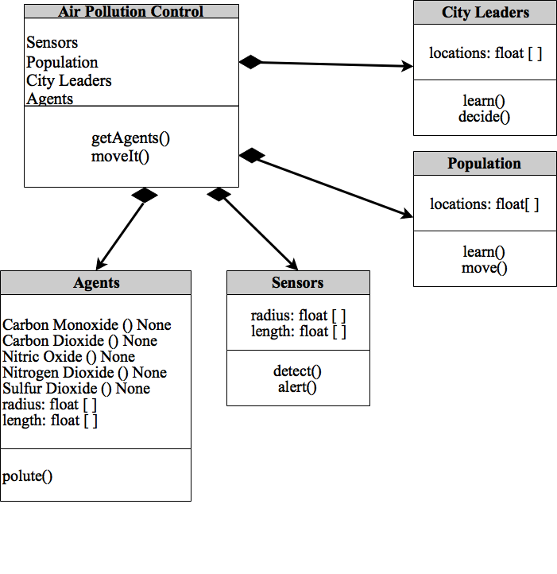
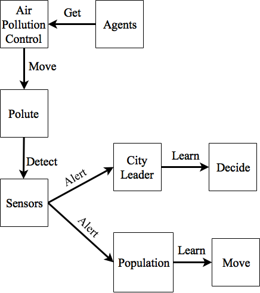

# Assignment1 - Practice Designing Models (Template)

> * Participant name: Brian Varns
> * Project Title: Air Pollution Control

## General Introduction

A **smart city** is an urban area that uses different types of electronic data collection sensors to supply information which is used to manage assets and resources efficiently.

Over 2 Billion people live in cities with air quality below World Health Organization guidelines.  Removing air pollution completely is currently impossible, but providing relief to these people is not.  Through a system of sensors, designed to gather microclimate data measurements for EPA pollutants, companies like Bosch are attempting to provide relief to citizens and provide data for city leaders to make more efficient decisions.  Bosch's Air Quality Micro Climate Monitoring System (MCMS) is currently in development to meet this need.

## Requirements (Experimental Design)

Null Hypothesis: Providing accurate and timely data on EPA pollutants will have no effect on allowing the population to make smarter decisions and improve their quality of life.

Hypothesis: Providing accurate and timely data on EPA pollutants will allow the population to make smarter decisions and improve their quality of life.

For this experiment, simulating an entire cities air pollution control system would be far too large of an undertaking.  Instead, I'll focus on one city block.  There will be one component, Air Pollution Control, with four sub-components Sensors, Agents, Population, and City Leaders.  Sensors will collect data from the atmosphere around the city block and notify the Population on the EPA pollutants in their area.  If the EPA pollutants are too high it will notify the population that it is unsafe to conduct specific activities like exercise outside, walk your pet, etc.  The alerts they receive will be determined by the amount of EPA pollutants in their area.

Additionally, I'll look at the impacts these sensors have on city leaders and their decision making for day to day operations of the city.  As data comes in city leaders can make decisions to close certain bridges and reroute traffic to help control the level of pollutants in an area.

The Air Pollution Control System (ACPS) will set the following requirements:

•100% reduction in population conducting activities outside in heavy pollution.

•80% reduction in population conducting activities outside in medium pollution.

•10% or less of total system alerts are false positives

## Smart City (My Problem) Model

## Object Diagram

## Class Diagram

## Behavior Diagram

## Smart City (My Problem) Simulation

An agent based simulation is the best choice to simulate the Air Pollution Control System because it requires significant human/agent interaction. Specifically, Anylogic is a great tool to simulate the interaction of agents on the ACPS's Sensors, Population, and City Leaders.

An example is included in the [**Analysis**](https://github.com/IDS6145-18Spring/assignment-1-practice-designing-models-Brian-Varns/tree/master/analysis) file.

## Smart City (My Problem) Model
[**Air Pollution Control**](https://github.com/IDS6145-18Spring/assignment-1-practice-designing-models-Brian-Varns/commit/d12d75ca3b12b0fd20e0f64231f444700ce1df90?diff=unified) - Coding Framework

## **A**ir **P**ollution **C**ontrol **S**ystem (**ACPS**) Model
Here [**we provide an overview**](https://github.com/IDS6145-18Spring/assignment-1-practice-designing-models-Brian-Varns/blob/master/code/README.md) of the **A**ir **P**ollution **C**ontrol **S**ystem (**ACPS**) Model and provide a source code template.
