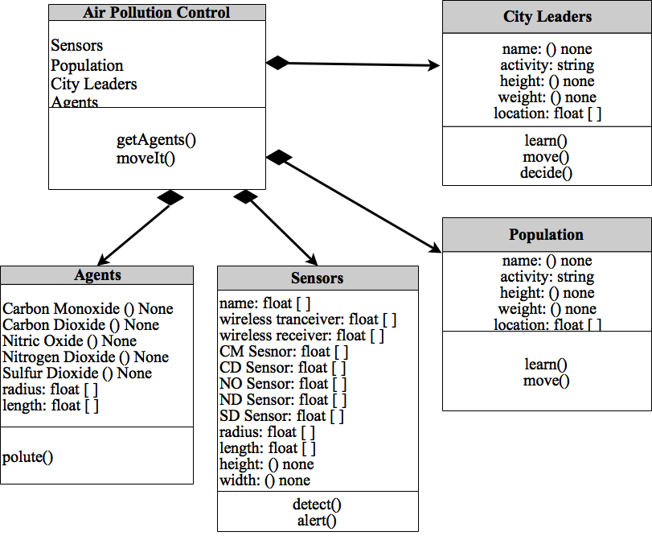

# Assignment1 - Practice Designing Models (Template)

> * Participant name: Brian Varns
> * Project Title: Air Pollution Control

## General Introduction

A **smart city** is an urban area that uses different types of electronic data collection sensors to supply information which is used to manage assets and resources efficiently.

Over 2 Billion people live in cities with air quality below World Health Organization guidelines.  Removing air pollution completely is currently impossisible, but providing relief to these people is not.  Through a system of sensors, designed to gather microclimate data measurements for EPA pollutants, companies like Bosch are attempting to provide relief to citizens and provide data for city leaders to make more efficient decisions.  Bosch's Air Quality Micro Climate Monitoring System (MCMS) is currently in development to meet this need.

## Requirements (Experimental Design)

Hypothesis: Providing accurate and timely data on EPA pollutants will allow the population to make smarter decisions and improve their quality of life.

For the purpose of this experiment, simulating an entire cities air pollution control system would be far too large of an undertaking.  Instead, I'll focus on one city block.  There will be one component, Air Pollution control, with two sub-components Sensors and Population.  Sensors will collect data from the atmosphere around the city block and notify the Popluation on the EPA pollutants in their area.  If the EPA pollutants are too high it will notify the popluation that it is unsafe to conduct specific activities like exercise outside, walk your pet, etc.  The alerts they recieve will be determined by the amount of EPA pollutants in their area.

## Smart City (My Problem) Model

## Object Diagram

## Class Diagram

## Behavior Diagram

## Smart City (My Problem) Simulation

(remove: for part 3 add two to three sentences here and link the [**(your own name)**](model/README.md) file in the analysis folder - which describe how you would simulate this - type of simulation, rough details -inputs, outputs - how it will help you analyze your experimental hypothesis, or nullify your null hypothesis.)

## Smart City (My Problem) Model
[Air Pollution Control](https://github.com/IDS6145-18Spring/assignment-1-practice-designing-models-Brian-Varns/commit/d12d75ca3b12b0fd20e0f64231f444700ce1df90?diff=unified) - Coding Framework

## **P**ortable **O**rganic **T**rouble-free **S**elf-watering System (**POTS**) Model
Here [**we provide an overview**](code/POTS_system/README.md) of the **P**ortable **O**rganic **T**rouble-free **S**elf-watering System (**POTS**) Model and provide a source code template.
